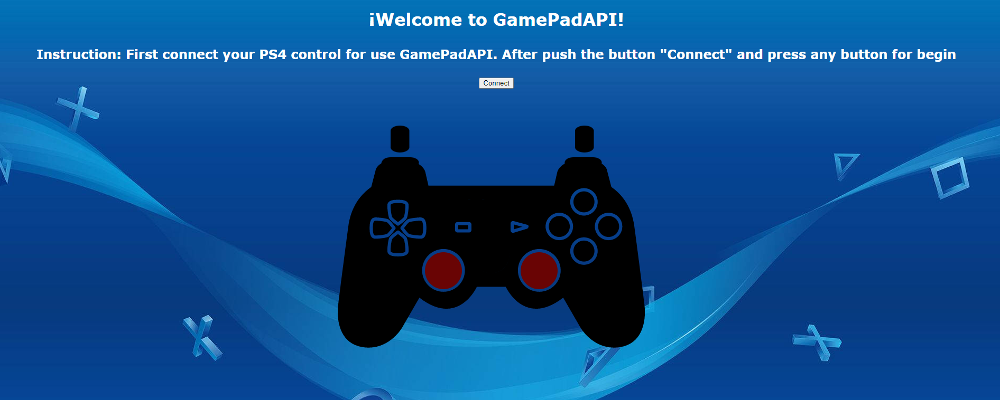
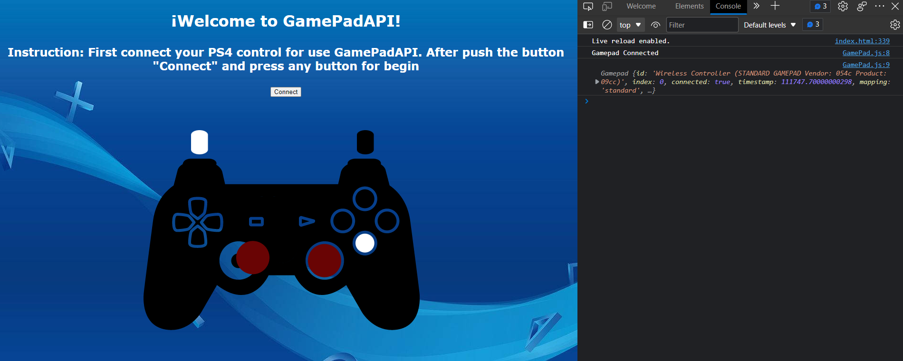

  

## Tecnológico Nacional de México
## Instituto Tecnológico de Tijuana
## Subdirección Académica
## Departamento de Sistemas y Computación

## FEB - JUN 2023

## Carrera:
#### Ingeniería en Sistemas Computacionales

## Materia y Serie:
#### Programación Web | AEB-1055

## Práctica: GamePad API

## Unidad I

## Alumno y Número de Control:
#### Calderón Gastelum Sergio Leonel - 18212153

## Docente:
#### Dra. Daniela Adriana Sánchez Vizcarra.

## Fecha de Entrega:
#### Viernes, 17 de febrero de 2022

---

# Introducción
Para esta práctica, se llevará a cabo el uso de una API, la cual es seleccionada días previos para posteriormente trabajar con ello en Visual Studio Code, donde se utilizarán los lenguajes de programación de JavaScript y HTML, y realizar la conexión de este. El objetivo de está práctica será lograr funcionar la API una vez programado en el software VS y finalmente implementar extensión de LiveServer para ver en vivo el funcionamiento del mismo en el navegador; en este caso se utilizará GamePad API, el cual para el usuario se le mostrará el diseño de un mando de PS4, donde deberá conectar su mando al dispositivo en el que se ejecuta el código y por medio de ello podrá visualizar los movimientos realizados en el mando reflejado en la pestaña en funcionamiento.

---

# Contenido
## Conceptos
#### Fetch()
Básicamente la función de Fetch() consiste en peticiones y respuestas de un servidor en línea, esto quiere decir lo siguiente: cuando nosotros en este caso requerimos recibir los datos de una API, basta con llamar al servidor de este por medio de la URL y se llevaría a cabo la petición; como respuesta esos datos se almacenan en una variable hasta el .json, donde en base a ello podemos realizar la manipulación de esta para desplegar la información de una manera en específica como un arreglo en el caso de Map().

#### Map()
Por otro lado, tenemos la función de Map, por medio de esta función permite “acomodar” los datos recibidos una vez que se establece la llamada con el fetch, donde estos son almacenados en un arreglo posteriormente recibiendo 3 segmentos sobre ello: el dato recibido actualmente, su índice y el arreglo en el que se está llamando.

## Pantallas principales

Figura 1. Inicio de la API (GamePadAPI)

Figura 2. Funcionamiento de la API (GamePadAPI)

## Código principal.
#### HTML (Código de la Página y Modelo del Mando de PS4).